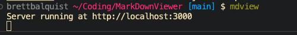
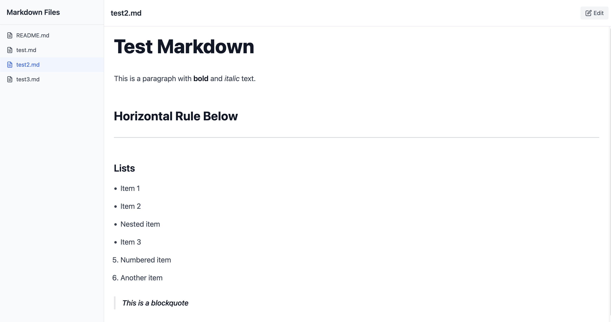

# Markdown Viewer (mdview)

A simple, browser-based markdown viewer that launches from your terminal. View and edit markdown files with live preview, supporting common markdown syntax.

Jupyter for Markdown 


## Dependencies

- Node.js (v14 or higher)
- npm or yarn
- React 18+
- Express
- TailwindCSS
- marked (for markdown parsing)

## Architecture

The project follows a client-server architecture:

### Server-side (`server.js`)
- Express server that handles:
  - Serving the static React application
  - File system operations (reading/writing markdown files)
  - Directory scanning for markdown files
  - WebSocket connections for real-time updates

### Client-side
- **Main Entry (`main.jsx`)**
  - React application entry point
  - Sets up routing and global state
  
- **MarkdownViewer Component**
  - Main component handling:
    - File listing
    - File selection
    - Edit/Preview toggle
    - Real-time markdown rendering
    - File saving

### Data Flow
1. Server scans directory for .md files
2. Client requests file list
3. User selects a file
4. Content is loaded and rendered
5. Changes are saved back to filesystem

## Installation

```bash
# Clone the repository
git clone https://github.com/brett-b112/mdview.git

# Navigate to the project directory
cd mdview

# Install dependencies
npm install

# Build the project
npm run build

# Install globally
npm link
```

## Usage

```bash
# View markdown files in current directory
mdview

# View markdown files in a specific directory
mdview /path/to/directory
```

### Keyboard Shortcuts

- Click "Edit" to modify content
- Click "Save" to save changes
- Click "Preview" to view rendered markdown

## Development

```bash
# Install dependencies
npm install

# Run in development mode
npm run dev

# Build for production
npm run build
```

## Example Running


## Example Useage


## Supported Markdown Syntax

### Headers

```markdown
# H1 Header
## H2 Header
### H3 Header
```

### Lists

```markdown
- Unordered list item
  - Nested item
* Another item
1. Ordered list item
2. Second item
```

### Code Blocks

````markdown
```javascript
console.log("Hello, World!");
```
````

### Blockquotes

```markdown
> This is a blockquote
```

### Tables

```markdown
| Header 1 | Header 2 |
|----------|----------|
| Cell 1   | Cell 2   |
```

### Task Lists

```markdown
- [ ] Unchecked task
- [x] Checked task
```

### Horizontal Rules

```markdown
---
```

### Emphasis

```markdown
**Bold text**
*Italic text*
***Bold and italic***
```

MIT License
